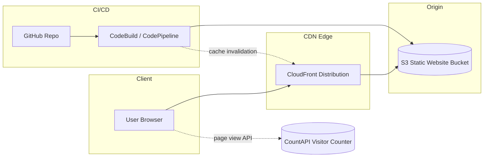

# Rafael's Resume Website 

Single-page resume site built with **React**, **TypeScript**, and **Vite**, deployed to **Amazon S3 + CloudFront**.  
The goal is to present cloud/DevOps experience clearly while keeping the stack simple, observable, and cheap to run.

## Features

- **Focused single-page layout**: Hero, experience, certifications, and contact, optimized for quick scanning by hiring managers.
- **Production-grade static hosting**: Pre-built assets served from S3 via CloudFront with aggressive caching.
- **Visitor telemetry**: Lightweight page view counter to validate traffic from resumes and social links.
- **Mobile-first UI**: Responsive layout with a dark theme that renders cleanly on phones and large displays.

## Tech Stack

- **Frontend**: React 18, TypeScript, Vite.
- **Styling**: Single global CSS file; no runtime CSS-in-JS.
- **Hosting**: S3 static website + CloudFront distribution.
- **Tooling**: AWS CodePipeline / CodeBuild using `buildspec.yml`.

## Architecture



## Local Development

```bash
npm install
npm run dev
```

The development server opens automatically at `http://localhost:5173`.

## Production Build

```bash
npm run build
```

Outputs a static bundle in the `dist/` directory ready for S3.

## Continuous Deployment (CodePipeline / CodeBuild)

`buildspec.yml` describes the CI/CD behavior for CodeBuild:

```yaml
version: 0.2
env:
  variables:
    S3_BUCKET: madebyraf.tech-resumewebsite
    CLOUDFRONT_DISTRIBUTION_ID: E2TSQIE9BDWTRX
phases:
  install:
    runtime-versions:
      nodejs: 18
    commands:
      - npm ci
  build:
    commands:
      - npm run build
  post_build:
    commands:
      # Sync all files (adds/removes as needed)
      - aws s3 sync dist/ "s3://$S3_BUCKET" --delete
      # Ensure HTML has a short cache (fast deploys)
      - aws s3 cp dist/index.html "s3://$S3_BUCKET/index.html" --cache-control "public, max-age=300" --content-type "text/html"
      # Give hashed assets a long cache (cheap & fast)
      - aws s3 cp dist/assets/ "s3://$S3_BUCKET/assets/" --recursive --cache-control "public, max-age=31536000, immutable"
      - aws cloudfront create-invalidation --distribution-id "$CLOUDFRONT_DISTRIBUTION_ID" --paths "/*"
```

Connected to CodePipeline, every commit produces a new static build, updates S3, and invalidates CloudFront.

## Deploy to S3

1. Build the site:

```bash
npm run build
```

2. Sync the `dist/` folder to your S3 bucket:

```bash
aws s3 sync dist/ s3://<your-bucket-name> --delete
```

3. Optional: Create a CloudFront invalidation:

```bash
aws cloudfront create-invalidation --distribution-id <distribution-id> --paths "/*"
```

## Legacy Assets

The former static HTML/CSS version is preserved in `legacy-site/` for reference.

## Support My Work

If you enjoy my projects or want to support my work, you can buy me a coffee:
[https://buymeacoffee.com/terminalsandcoffee](https://buymeacoffee.com/terminalsandcoffee)

## Connect With Me

* LinkedIn: [rgmartinez-cloud](https://www.linkedin.com/in/rgmartinez-cloud/)
* Blog: [Medium](https://medium.com/@terminalsandcoffee)
* GitHub: [TerminalsandCoffee](https://github.com/TerminalsandCoffee)

---

Built with 💻 and ☕ by Rafael Martinez

